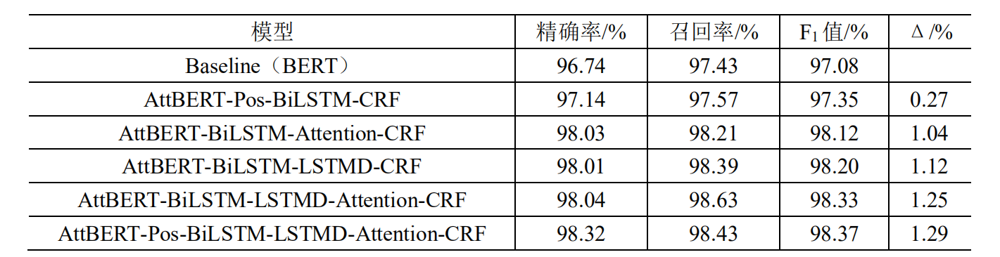

# 毕业设计：
基于Bert_Position_BiLSTM_Attention_CRF_LSTMDecoder的法律文书要素识别
# 实验结果

# 论文
https://kns.cnki.net/kcms/detail/detail.aspx?dbcode=CMFD&dbname=CMFDTEMP&filename=1021517817.nh&v=TJenSmKXu1hVfrMJ0IPfDGSWBuwNmuS6lfzuobzusC8XnDXsKf6SK0%25mmd2BkVWLlBM97
法律文书要素的识别方法研究与实现
